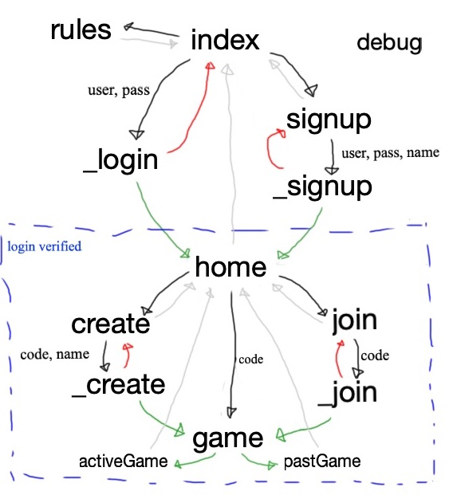

# 2020 Don't Say Pineapple Website Repository
This is a website for playing Don't Say Pineapple, or DSP for short. DSP is a social game for groups that constantly communicate. Detailed rules are written on the /rules page of the website.

## Features Description
 The website works as a shuffler for the game. It hands out words and targets for the players. The game settings allow for various word difficulties and pass-on methods. The host of the game can kick players before the game has started or purge them after the game has started (for reasons such as inactivity or misbehavior). Each player can choose one of the theme for the aesthetics of their account and a status for everyone to see. Each past game is stored and can be accessed by anyone to see the results (with a provided kill log).

## Account Security
A complete login system is implemented. Passwords are securely stored hashed with salt. Each page except the index and rules page can only be accessed if the user is logged in. The password and username are stored locally through session variables.

## Project Structure
This is a Flask application. The main app is in the app.py file. Helper functions are stored in the checks.py, verifiers.py, maff.py, and fetchers.py files. This site uses a SQLite database (the database.db file). The databaseSetup file is used only to create a clean database and not used while the app is running. This is the structure of the site:

## Support
Found a bug?
Have questions?
Have suggestions?
Don't hesitate to email styopa@stanford.edu . 
Any feedback would be greatly appreciated!

### Word Bank Help
Our word banks are only 300 words each! Any help on creating larger word banks would be great. We are thinking of adding an 'extra hard' word category in addtion to the three we have currently. This would contain thesaurus words. 

### Art Help
Given my basic drawing software, my slow trackpad, and lack of motivation, I can only do so much art. If you would like to improve on (or add to) any of the artwork or design on the website, send an email! Themes, logos, styles, and colors are all good things to ask about.